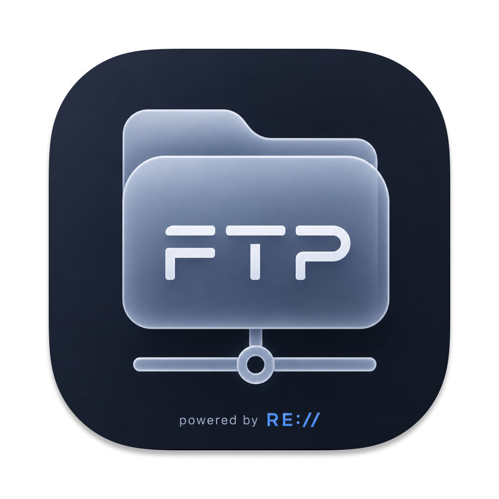

# RECORE FTP

A premium, state-of-the-art FTP/SFTP client built with performance and aesthetics in mind. Designed for developers who value speed, security, and a beautiful user interface.



## 🚀 Key Features

- **Multi-Protocol Support**: Seamlessly connect to FTP, SFTP (SSH), and prepared for Amazon S3 & Google Drive.
- **Premium Themes**: Includes high-end color palettes like Catppuccin (Latte, Mocha, Macchiato), Cyberpunk 2077, Gruvbox, and more.
- **Dynamic Interface**: Modern, glassmorphism-inspired design with smooth transitions and micro-animations.
- **Smart Connection Management**: ID-based bookmark synchronization that prevents duplicates and ensures data integrity.
- **Universal Search**: Fast, recursive search across local and remote file systems.
- **Media Preview**: Built-in support for viewing images, videos, and documents directly within the app.
- **Secure by Design**: Local-first storage of credentials using encrypted system paths. No data ever leaves your machine.

## 🛠 Tech Stack

- **Core**: Electron, Vite, TypeScript
- **Frontend**: React, Lucide Icons
- **Logic**: SSH2, Basic-FTP
- **Build**: Electron Builder

## 📥 Installation

### For macOS
1. Download the latest `RECORE-FTP-Setup.dmg`.
2. Drag **RECORE FTP** to your **Applications** folder.
3. **Security Fix (Required for first run)**: macOS may say the app is "Damaged" or "Move to Trash" because it's not signed. To fix this, run this command in your Terminal:

   ```bash
   # If you moved it to Applications:
   xattr -cr /Applications/RECORE\ FTP.app
   
   # If it's still in your Downloads:
   xattr -cr ~/Downloads/RECORE\ FTP.app
   ```

4. **Alternative**: Right-click the app -> Select **Open** -> Click **Open** again.

### For Windows
1. Download `RECORE-FTP-Setup.exe`.
2. Run the installer and follow the instructions.

## 💻 Development

```bash
# Install dependencies
npm install

# Run in development mode
npm run dev

# Build for macOS
npm run build:mac

# Build for Windows
npm run build:win
```

## 🔐 Security

RECORE FTP uses `electron-store` to save your bookmarks locally. Your data is stored in:
- **macOS**: `~/Library/Application Support/RECORE FTP/`
- **Windows**: `%APPDATA%/RECORE FTP/`

**Note**: Your connection credentials are never committed to version control.

## 👤 Author

Developed by **iRussellua**

## 📄 License

This project is licensed under the MIT License.
